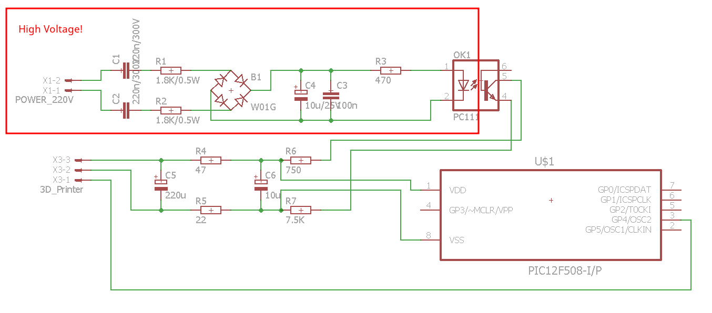
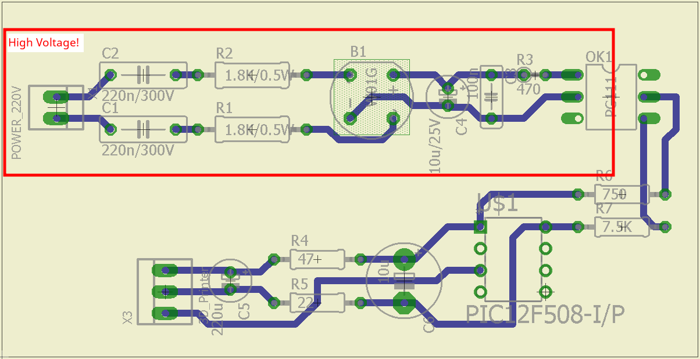
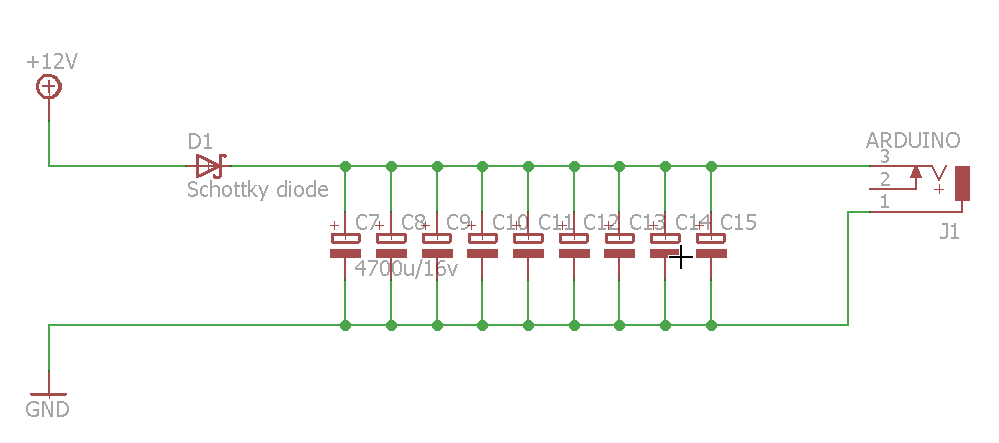

# 3DPrinterSPD
3D Printer power failure detection 

## **Warning: This project involve Power Line Voltage! If you are not sure of how to work with high voltage, please, do not do it.**

A project which allows power failure detection on 3D printers using a **PIC12F508-I/P**.  
I tested only on **Marlin firmware** and **Arduino Mega 2560**, but should work on any other board and software, if the software supports **Power Loss Recovery**.  
You need to connect the **`POWER_220V`** pins to the power line (220V-240V)  
Also **`3D_Printer`** pins are used to power up the microcontroller as follows:

1. X3-1 - connect it on a input pin on your 3D printer motherboard, and it will indicate the power failure
2. X3-2 - ground
3. X3-3 - 5V

The power failure will be triggered after **~82ms**  
I put all the components on a perfboard and, because the result was small enough, I put it in the power supply case. Of course, I isolated the board using heat shrink tubing.

## Compiled code
[Here](binaries/3DPrinterSPD.production.hex) is the hex file which contain the compiled code


## The schematic


## An example board



If your power supply is not providing enough power for your printer to opperate another 1 or 2 seconds after failure, you will need a energy reservoir for motherboard.  
When the printer is using the common `Arduino Mega 2560`, this is easily achieved by connecting some capacitors between the arduino power barrel and the power source like in the following image:  



I used 9 4700uF/16V capacitors and a low voltage drop Schottky diode.

## Marlin configuration in Configuration_adv.h file

```
-  //#define POWER_LOSS_RECOVERY
+  #define POWER_LOSS_RECOVERY
   #if ENABLED(POWER_LOSS_RECOVERY)
-    #define PLR_ENABLED_DEFAULT   false // Power Loss Recovery enabled by default. (Set with 'M413 Sn' & M500)
+    #define PLR_ENABLED_DEFAULT  true // Power Loss Recovery enabled by default. (Set with 'M413 Sn' & M500)
     //#define BACKUP_POWER_SUPPLY       // Backup power / UPS to move the steppers on power loss
     //#define POWER_LOSS_RECOVER_ZHOME  // Z homing is needed for proper recovery. 99.9% of the time this should be disabled!
     //#define POWER_LOSS_ZRAISE       2 // (mm) Z axis raise on resume (on power loss with UPS)
-    //#define POWER_LOSS_PIN         44 // Pin to detect power loss. Set to -1 to disable default pin on boards without module.
-    //#define POWER_LOSS_STATE     HIGH // State of pin indicating power loss
+    #define POWER_LOSS_PIN         44 // Pin to detect power loss. Set to -1 to disable default pin on boards without module.
+    #define POWER_LOSS_STATE     HIGH // State of pin indicating power loss
     //#define POWER_LOSS_PULLUP         // Set pullup / pulldown as appropriate for your sensor
-    //#define POWER_LOSS_PULLDOWN
-    //#define POWER_LOSS_PURGE_LEN   20 // (mm) Length of filament to purge on resume
+    #define POWER_LOSS_PULLDOWN
+    #define POWER_LOSS_PURGE_LEN   20 // (mm) Length of filament to purge on resume
     //#define POWER_LOSS_RETRACT_LEN 10 // (mm) Length of filament to retract on fail. Requires backup power.
```


